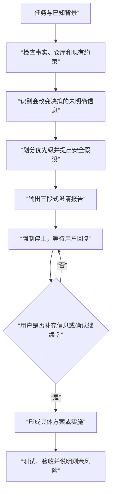

# Clarify Hidden Context

> 在 AI 开始设计方案或编写代码前，先找出那些“你可能已经知道、但还没有告诉 AI”的关键上下文。

`clarify-hidden-context-skills` 是一个面向 Codex 的需求澄清 skill。它借用“乔哈里视窗中的隐藏区”这一思路，帮助开发者在功能开发、系统设计、AI 应用构建和 vibe coding 过程中，识别会显著改变实现路径的未说明信息。

它不会一上来就生成架构或代码，而是先区分事实、推断和未知信息，提出少量高影响问题；等上下文充分后，再输出或实施具体方案。

## 它解决什么问题

使用 AI 辅助开发时，很多失败并不是代码不会写，而是上下文没有对齐。

例如，开发者可能已经知道：

- 这是一次性原型还是长期维护的产品；
- 真正的目标用户和核心使用路径；
- 必须沿用的技术栈、现有模块和部署环境；
- 怎样才算“完成”；
- 是否涉及敏感数据、付费 API 或生产环境；
- 更重视交付速度、可读性，还是性能与扩展性。

如果这些信息没有进入提示词，AI 往往会用通用假设补齐空白。结果可能在技术上成立，却不符合真实目标，最终带来返工、架构偏差、成本失控或安全风险。

这个 skill 的目标是把这些高影响信息提前显性化。

## 核心能力

- **先查证，再提问**：优先检查已有仓库、代码、配置和文档，不询问可以自行发现的事实。
- **识别决策性未知信息**：只关注会改变范围、架构、实现方式或验收标准的信息。
- **按影响分级**：区分”必须确认””建议确认”和”可安全假设”三个优先级。
- **控制问题数量**：首轮最多 3–5 个问题，通常控制在更少。
- **提供安全默认值**：优先选择可逆、低成本、可测试且符合现有项目的假设，每个假设说明”采用什么、为什么合理、如何验证”。
- **强制两阶段推进**：第一阶段输出三段式澄清报告后强制停止，等待用户回复；第二阶段根据用户确认形成方案或实施。
- **避免过度澄清**：当没有阻塞项且用户允许时，可在 [可安全假设] 中列出默认值并引导快速确认。

## 工作流程



第一阶段固定输出（三段式结构）：

1. **当前已明确的信息**：总结任务、目标、约束
2. **关键未明确信息与问题**：按 [必须确认] / [建议确认] / [可安全假设] 分组
3. **下一步**：根据情况 A/B/C 给出明确引导语

**⚠️ 核心机制**：无论任何情况，skill 都必须先完成第一阶段的三段式输出，然后强制停止等待用户回复，绝不在同一轮直接进入第二阶段。

用户补充信息或确认继续后，skill 进入第二阶段，根据任务需要给出架构设计、文件级改动、关键代码、测试和验收步骤。

## 适用场景

适合在以下任务开始前使用：

- 开发一个新功能或 MVP；
- 构建 CLI、Web 应用、API 或内部工具；
- 设计 AI 应用、Agent 或 Prompt 工作流；
- 为现有仓库增加模块或进行较大改造；
- 优化一段代码，但目标和约束还不完整；
- 在 vibe coding 前快速补齐需求上下文；
- 希望 AI 先问关键问题，而不是立即生成代码。

对于完全明确、低风险、一步即可完成的小修改，通常不需要完整运行这套流程。

## 安装

Codex 支持用户级和仓库级 skill：用户级 skill 可用于本机任意项目，仓库级 skill 仅在对应项目中生效。目录约定可参考 [Codex 官方 Build skills 文档](https://developers.openai.com/codex/build-skills)。

### 方式一：使用 Skill Installer（推荐，所有操作系统）

这种方式适用于 macOS、Linux 和 Windows，不需要手动处理安装目录。

在 Codex 中输入：

```text
使用 $skill-installer 安装以下 GitHub 仓库中的 skill：

仓库：https://github.com/qfuzj/clarify-hidden-context-skills
skill 路径：.
安装名称：clarify-hidden-context
```

> `$skill-installer` 会使用 Codex 配置的 skill 目录，默认安装到 `$CODEX_HOME/skills`；未设置 `CODEX_HOME` 时通常为 `~/.codex/skills`。

### 方式二：macOS / Linux

以下命令适用于 Bash、Zsh 等常见 Shell。执行前请确认已经安装 [Git](https://git-scm.com/)。

#### 安装为用户级 skill

安装后可在本机所有项目中使用：

```bash
mkdir -p "$HOME/.agents/skills"
git clone https://github.com/qfuzj/clarify-hidden-context-skills.git \
  "$HOME/.agents/skills/clarify-hidden-context"
```

#### 安装到当前仓库

在目标仓库根目录执行，仅让该仓库使用此 skill：

```bash
mkdir -p .agents/skills
git clone https://github.com/qfuzj/clarify-hidden-context-skills.git \
  .agents/skills/clarify-hidden-context
```

### 方式三：Windows

以下命令适用于 PowerShell。执行前请确认已经安装 [Git for Windows](https://git-scm.com/download/win)。

#### 安装为用户级 skill

安装后可在本机所有项目中使用：

```powershell
$repoUrl = "https://github.com/qfuzj/clarify-hidden-context-skills.git"
$skillsRoot = Join-Path $HOME ".agents\skills"
$destination = Join-Path $skillsRoot "clarify-hidden-context"

New-Item -ItemType Directory -Force -Path $skillsRoot | Out-Null
git clone $repoUrl $destination
```

#### 安装到当前仓库

在目标仓库根目录打开 PowerShell 并执行：

```powershell
$repoUrl = "https://github.com/qfuzj/clarify-hidden-context-skills.git"
$skillsRoot = Join-Path (Get-Location) ".agents\skills"
$destination = Join-Path $skillsRoot "clarify-hidden-context"

New-Item -ItemType Directory -Force -Path $skillsRoot | Out-Null
git clone $repoUrl $destination
```

### 方式四：手动安装

从 GitHub 下载并解压仓库，然后将整个目录复制到以下任一位置。

#### macOS / Linux

```text
用户级：~/.agents/skills/clarify-hidden-context/
仓库级：<仓库根目录>/.agents/skills/clarify-hidden-context/
```

#### Windows

```text
用户级：%USERPROFILE%\.agents\skills\clarify-hidden-context\
仓库级：<仓库根目录>\.agents\skills\clarify-hidden-context\
```

无论使用哪种方式，安装后的关键结构都应为：

```text
clarify-hidden-context/
├── SKILL.md
├── README.md
└── agents/
    └── openai.yaml
```

### 确认安装

- 在 Codex CLI 或 IDE 中运行 `/skills`，或输入 `$` 后查找 `clarify-hidden-context`。
- 在桌面端打开侧栏中的 Skills，确认该 skill 已出现。
- Codex 通常会自动检测新安装的 skill；如果没有出现，请重启 Codex。

## 快速开始

在 Codex 中显式调用 `$clarify-hidden-context`：

```text
使用 $clarify-hidden-context 帮我处理下面的开发任务。

任务：
开发一个面向小团队的 AI 会议纪要 Web 应用。

已知背景：
使用 Next.js，调用大模型 API，先做 MVP。

先只进行隐藏区检查，不要输出代码。等我补充信息后再给出实现方案。
```

skill 会先总结已知信息、识别高影响缺口，并按优先级提出问题或给出安全假设，而不是立即开始实现。

预期的第一阶段响应结构（三段式）：

```text
一、当前已明确的信息
- 任务：开发面向小团队的 AI 会议纪要 Web 应用
- 技术栈：Next.js，调用大模型 API
- 目标：先做 MVP

二、关键未明确信息与问题

[必须确认]
- MVP 的完成标准是什么？（为什么重要：会改变功能范围、测试覆盖和验收方式）
- 会议数据如何获取？（选项 A: 用户手动上传录音，B: 接入在线会议 API，C: 用户直接粘贴文本。建议 A，因为实现最简单且无依赖外部服务）

[建议确认]
- 用户认证方式？（默认假设：简单的邮箱+密码，影响：暂不支持 OAuth，可后续扩展）

[可安全假设]
- 部署方式：采用 Vercel 部署（理由：与 Next.js 深度集成，验证方式：开发完成后实际部署测试）
- 数据存储：采用 PostgreSQL + Prisma（理由：符合你提到的技术栈，验证方式：通过实际数据操作确认性能）

三、下一步
请补充以上 [必须确认] 部分的信息，我将基于你的回答和已列出的安全假设形成具体方案。
```

**⚠️ 输出后 skill 会立即停止，等待你的回复，不会在同一轮继续推进。**

## 使用示例

### 示例一：新项目需求澄清

```text
使用 $clarify-hidden-context。

我想开发一个 AI 知识库，供 10 人以内的团队使用。
目前确定使用 Next.js 和 PostgreSQL。

请先找出会影响 MVP 实现的隐藏信息，最多问我 4 个问题。
```

适合用于确定内容来源、权限边界、检索质量标准、模型选择和数据隐私要求。

### 示例二：为现有仓库增加功能

```text
使用 $clarify-hidden-context 帮我规划这个需求：

给现有 Python CLI 增加 CSV 导出。
请先检查仓库和已有测试，不要询问能从代码中确认的信息。
完成隐藏区检查后等我回复，再开始修改。
```

在仓库可访问且相关信息能够确认时，skill 会先检查并优先沿用现有的命令结构、依赖和测试方式，再询问真正无法从代码中确认的决策。

### 示例三：允许按默认假设继续

```text
使用 $clarify-hidden-context。

我要把一个本地 JSON 脚本做成 Python CLI，并支持导出 UTF-8 CSV。
先做隐藏区检查；如果没有安全或不可逆的阻塞项，就按建议默认值继续给出实施方案，不用等我确认。
```

在这种模式下，skill 仍会明确列出假设，但不会因为低风险信息缺失而停止推进。

### 示例四：只要方案，不修改代码

```text
使用 $clarify-hidden-context 评审这个系统设计。

先补齐隐藏上下文，再给出架构建议和风险分析。
只输出方案，不要修改仓库中的任何文件。
```

skill 会遵循任务边界，不会把“给方案”自动扩大成“直接实施”。

## 常用控制语句

可以在请求中加入以下表达来控制工作方式：

| 目标 | 推荐表达 |
| --- | --- |
| 第一阶段后暂停 | `先只做隐藏区检查，等我回复后再继续。` |
| 限制问题数量 | `只问最关键的 3 个问题。` |
| 自动采用默认值 | `没有阻塞项时按默认假设继续，不用等我确认。` |
| 避免重复提问 | `先检查仓库，不要问能从代码和配置中确认的信息。` |
| 只输出设计 | `只给方案，不要修改文件。` |
| 直接实施 | `信息充分后直接实现并运行测试。` |

## 设计原则

### “隐藏区”不是”盲区”

这里使用的是乔哈里视窗中的”隐藏区”类比：用户可能掌握某些信息，但尚未在当前对话中提供。skill 不会分析用户的心理，也不会评价用户的认知能力。始终使用”可能””尚未明确”等措辞，不断言用户一定知道某信息。

### 强制澄清机制

**无论任何情况，skill 都必须先完成第一阶段的三段式澄清输出，然后强制停止等待用户回复。** 即使遇到以下情况也不能跳过：

- 用户给出看似完整的需求、验收标准、技术约束
- 任务看起来是修复明确的 bug、实现标准功能  
- 用户要求”按你的判断直接做””不用问我””直接实现”

这些情况下，仍需输出澄清报告，但可以在 [可安全假设] 中列出更多默认假设，并引导用户快速确认（”请回复'继续'即可按默认假设推进”）。

### 不把澄清变成问卷

七类上下文维度只是检查范围，不是必须逐项询问的模板。只有当不同答案确实会改变实现决策时，相关问题才应该被提出。

### 安全边界清单

以下情况**不得使用默认假设**，必须明确确认：

- 涉及生产环境数据、用户隐私、敏感信息
- 调用付费外部 API、云服务、第三方接口
- 执行不可逆操作（删除、覆盖、发布）
- 修改权限、认证、授权逻辑
- 影响安全、合规、审计要求的决策

### 假设质量标准

每个安全假设都必须说明三要素：
- **采用什么**：具体的技术选择或实现方式
- **为什么合理**：选择这个默认值的理由
- **如何验证**：后续如何确认或调整

## 项目结构

```text
.
├── SKILL.md              # skill 的核心触发说明与工作流
├── README.md             # 项目介绍、安装和使用文档
└── agents/
    └── openai.yaml       # Codex UI 展示信息与默认调用提示
```

这个项目是纯文本 skill，不依赖额外脚本、运行时或第三方服务。

## 常见问题

### 它会不会每次都阻塞开发？

不会。只有会使方案失效或带来明显风险的信息才属于“必须确认”。对于低风险、可回退的信息，可以明确默认值后继续。

### 它会直接修改代码吗？

取决于你的请求。要求评审、诊断或方案时，它只输出分析；明确要求构建或修改时，它会在上下文充分、环境与权限允许的情况下实施并验证，否则会说明阻塞项。

### 可以用于中文以外的任务吗？

可以。skill 会使用用户当前的语言输出；显式使用 `$clarify-hidden-context` 即可调用。

### 它能代替产品或安全评审吗？

不能。它用于尽早发现缺失上下文和风险，但不能替代正式的产品决策、安全审计或合规评估。

## 贡献

欢迎通过 Issue 或 Pull Request 提交改进建议，例如：

- 更真实的使用示例；
- 更准确的优先级判断规则；
- 减少无效问题或过度澄清的方法；
- 针对不同开发场景的工作流优化；
- 中英文触发描述和输出体验改进。

修改 skill 时，请尽量保持 `SKILL.md` 简洁，并优先增加可复用的判断规则，而不是堆叠固定问题模板。
