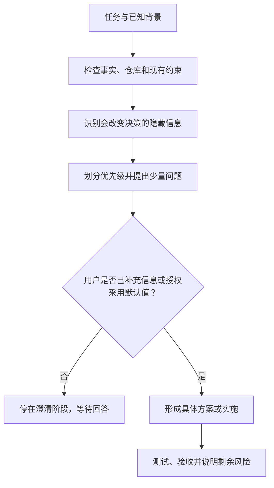

# Clarify Hidden Context

> 在 AI 开始设计方案或编写代码前，先找出那些“你可能已经知道、但还没有告诉 AI”的关键上下文。

`clarify-hidden-context-skills` 是一个面向 Codex 的需求澄清 skill。它借用“乔哈里视窗中的隐藏区”这一思路，帮助开发者在功能开发、系统设计、AI 应用构建和 vibe coding 过程中，识别会显著改变实现路径的未说明信息。

它不会一上来就生成架构或代码，而是先区分事实、推断和未知信息，提出少量高影响问题；等上下文充分后，再输出或实施具体方案。

## 它解决什么问题

使用 AI 辅助开发时，很多失败并不是代码不会写，而是上下文没有对齐。

例如，开发者可能已经知道：

- 这是一次性原型还是长期维护的产品；
- 真正的目标用户和核心使用路径；
- 必须沿用的技术栈、现有模块和部署环境；
- 怎样才算“完成”；
- 是否涉及敏感数据、付费 API 或生产环境；
- 更重视交付速度、可读性，还是性能与扩展性。

如果这些信息没有进入提示词，AI 往往会用通用假设补齐空白。结果可能在技术上成立，却不符合真实目标，最终带来返工、架构偏差、成本失控或安全风险。

这个 skill 的目标是把这些高影响信息提前显性化。

## 核心能力

- **先查证，再提问**：优先检查已有仓库、代码、配置和文档，不询问可以自行发现的事实。
- **识别决策性未知信息**：只关注会改变范围、架构、实现方式或验收标准的信息。
- **控制问题数量**：首轮最多提出 5 个问题，通常控制在 3–4 个。
- **按影响分级**：区分“必须确认”“建议确认”和“可以假设”。
- **提供安全默认值**：优先选择可逆、低成本、可测试且符合现有项目的假设。
- **两阶段推进**：先完成隐藏区检查，再根据用户回答或授权进入方案与实施。
- **避免过度澄清**：当没有阻塞项，且用户允许按默认判断继续时，直接推进任务。

## 工作流程



第一阶段固定输出：

1. 目前已经明确的信息
2. 可能存在的“隐藏区”信息
3. 信息优先级
4. 需要补充的问题
5. 默认假设

用户补充信息后，skill 再进入第二阶段，根据任务需要给出架构设计、文件级改动、关键代码、测试和验收步骤。

## 适用场景

适合在以下任务开始前使用：

- 开发一个新功能或 MVP；
- 构建 CLI、Web 应用、API 或内部工具；
- 设计 AI 应用、Agent 或 Prompt 工作流；
- 为现有仓库增加模块或进行较大改造；
- 优化一段代码，但目标和约束还不完整；
- 在 vibe coding 前快速补齐需求上下文；
- 希望 AI 先问关键问题，而不是立即生成代码。

对于完全明确、低风险、一步即可完成的小修改，通常不需要完整运行这套流程。

## 安装

Codex 支持用户级和仓库级 skill。用户级 skill 可用于任意项目，仓库级 skill 仅随对应项目生效。目录约定可参考 [Codex 官方 Build skills 文档](https://developers.openai.com/codex/build-skills)。

### 方式一：使用 Skill Installer（推荐）

在 Codex 中调用 `$skill-installer`，并提供本仓库地址：

```text
使用 $skill-installer 安装这个 GitHub 仓库中的 skill：
https://github.com/qfuzj/clarify-hidden-context-skills
```

### 方式二：安装为用户级 skill

这种方式会让 skill 在本机所有项目中可用：

```bash
REPO_URL="https://github.com/qfuzj/clarify-hidden-context-skills.git"
mkdir -p "$HOME/.agents/skills"
git clone "$REPO_URL" "$HOME/.agents/skills/clarify-hidden-context"
```

### 方式三：安装到单个仓库

在目标仓库根目录执行：

```bash
REPO_URL="https://github.com/qfuzj/clarify-hidden-context-skills.git"
mkdir -p .agents/skills
git clone "$REPO_URL" .agents/skills/clarify-hidden-context
```

### 方式四：手动安装

下载仓库后，将整个目录复制到：

```text
~/.agents/skills/clarify-hidden-context/
```

安装后的关键结构应为：

```text
clarify-hidden-context/
├── SKILL.md
├── README.md
└── agents/
    └── openai.yaml
```

### 确认安装

- 在 Codex CLI 或 IDE 中运行 `/skills`，或输入 `$` 后查找 `clarify-hidden-context`。
- 在桌面端打开侧栏中的 Skills，确认该 skill 已出现。
- Codex 通常会自动检测新安装的 skill；如果没有出现，请重启 Codex。

## 快速开始

在 Codex 中显式调用 `$clarify-hidden-context`：

```text
使用 $clarify-hidden-context 帮我处理下面的开发任务。

任务：
开发一个面向小团队的 AI 会议纪要 Web 应用。

已知背景：
使用 Next.js，调用大模型 API，先做 MVP。

先只进行隐藏区检查，不要输出代码。等我补充信息后再给出实现方案。
```

skill 会先总结已知信息、识别高影响缺口，并提出一组精简问题，而不是立即开始实现。

预期的第一阶段响应结构类似：

```text
一、目前已经明确的信息
- 已知任务、背景和约束……

二、可能存在的“隐藏区”信息
- 完成标准尚未明确：它会改变测试和验收方式。

三、信息优先级
- 必须确认：……
- 建议确认：……
- 可以假设：……

四、需要我补充的问题
1. 你希望用什么结果判断 MVP 已完成？

五、默认假设
- 默认先验证最小闭环；影响是暂不覆盖高级功能。
```

## 使用示例

### 示例一：新项目需求澄清

```text
使用 $clarify-hidden-context。

我想开发一个 AI 知识库，供 10 人以内的团队使用。
目前确定使用 Next.js 和 PostgreSQL。

请先找出会影响 MVP 实现的隐藏信息，最多问我 4 个问题。
```

适合用于确定内容来源、权限边界、检索质量标准、模型选择和数据隐私要求。

### 示例二：为现有仓库增加功能

```text
使用 $clarify-hidden-context 帮我规划这个需求：

给现有 Python CLI 增加 CSV 导出。
请先检查仓库和已有测试，不要询问能从代码中确认的信息。
完成隐藏区检查后等我回复，再开始修改。
```

在仓库可访问且相关信息能够确认时，skill 会先检查并优先沿用现有的命令结构、依赖和测试方式，再询问真正无法从代码中确认的决策。

### 示例三：允许按默认假设继续

```text
使用 $clarify-hidden-context。

我要把一个本地 JSON 脚本做成 Python CLI，并支持导出 UTF-8 CSV。
先做隐藏区检查；如果没有安全或不可逆的阻塞项，就按建议默认值继续给出实施方案，不用等我确认。
```

在这种模式下，skill 仍会明确列出假设，但不会因为低风险信息缺失而停止推进。

### 示例四：只要方案，不修改代码

```text
使用 $clarify-hidden-context 评审这个系统设计。

先补齐隐藏上下文，再给出架构建议和风险分析。
只输出方案，不要修改仓库中的任何文件。
```

skill 会遵循任务边界，不会把“给方案”自动扩大成“直接实施”。

## 常用控制语句

可以在请求中加入以下表达来控制工作方式：

| 目标 | 推荐表达 |
| --- | --- |
| 第一阶段后暂停 | `先只做隐藏区检查，等我回复后再继续。` |
| 限制问题数量 | `只问最关键的 3 个问题。` |
| 自动采用默认值 | `没有阻塞项时按默认假设继续，不用等我确认。` |
| 避免重复提问 | `先检查仓库，不要问能从代码和配置中确认的信息。` |
| 只输出设计 | `只给方案，不要修改文件。` |
| 直接实施 | `信息充分后直接实现并运行测试。` |

## 设计原则

### “隐藏区”不是“盲区”

这里使用的是乔哈里视窗中的“隐藏区”类比：用户可能掌握某些信息，但尚未在当前对话中提供。skill 不会分析用户的心理，也不会评价用户的认知能力。

### 不把澄清变成问卷

七类上下文维度只是检查范围，不是必须逐项询问的模板。只有当不同答案确实会改变实现决策时，相关问题才应该被提出。

### 不用默认值绕过高风险确认

涉及以下事项时，skill 会倾向于要求明确确认：

- 生产环境或真实用户数据；
- 权限、安全、隐私与合规；
- 付费 API 或明显成本；
- 数据删除、覆盖等不可逆操作；
- 对外发布或影响第三方的行为。

## 项目结构

```text
.
├── SKILL.md              # skill 的核心触发说明与工作流
├── README.md             # 项目介绍、安装和使用文档
└── agents/
    └── openai.yaml       # Codex UI 展示信息与默认调用提示
```

这个项目是纯文本 skill，不依赖额外脚本、运行时或第三方服务。

## 常见问题

### 它会不会每次都阻塞开发？

不会。只有会使方案失效或带来明显风险的信息才属于“必须确认”。对于低风险、可回退的信息，可以明确默认值后继续。

### 它会直接修改代码吗？

取决于你的请求。要求评审、诊断或方案时，它只输出分析；明确要求构建或修改时，它会在上下文充分、环境与权限允许的情况下实施并验证，否则会说明阻塞项。

### 可以用于中文以外的任务吗？

可以。skill 会使用用户当前的语言输出；显式使用 `$clarify-hidden-context` 即可调用。

### 它能代替产品或安全评审吗？

不能。它用于尽早发现缺失上下文和风险，但不能替代正式的产品决策、安全审计或合规评估。

## 贡献

欢迎通过 Issue 或 Pull Request 提交改进建议，例如：

- 更真实的使用示例；
- 更准确的优先级判断规则；
- 减少无效问题或过度澄清的方法；
- 针对不同开发场景的工作流优化；
- 中英文触发描述和输出体验改进。

修改 skill 时，请尽量保持 `SKILL.md` 简洁，并优先增加可复用的判断规则，而不是堆叠固定问题模板。
